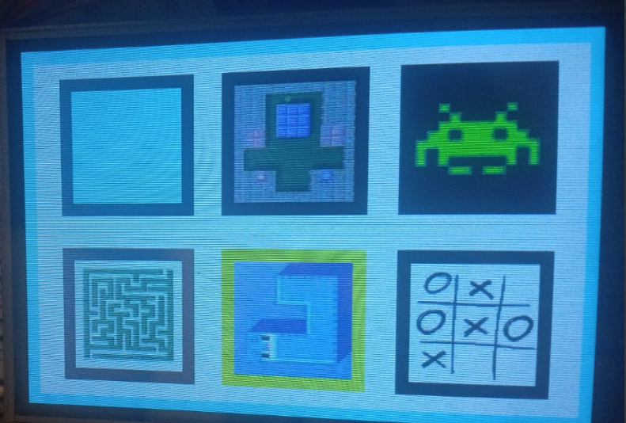
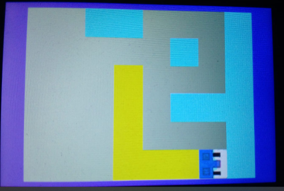
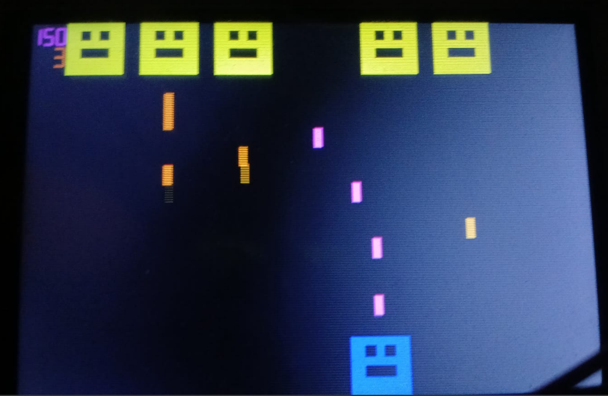
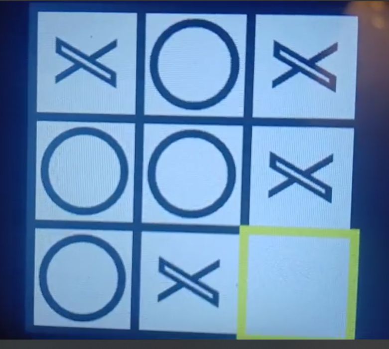
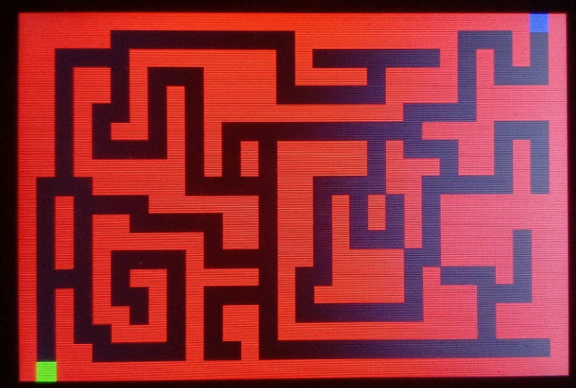
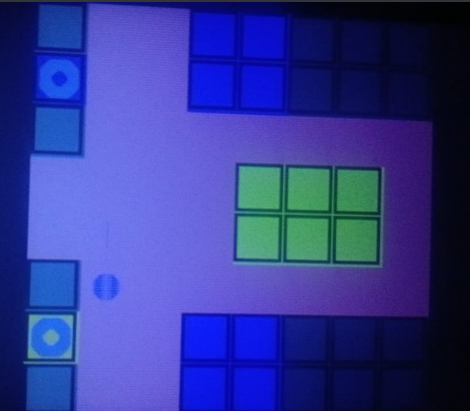

# 🎮 GameBoy Project

  

  

    A collection of classic arcade-style games implemented for STM32F401RC microcontroller.
  

  

## 🌟 Features

- 📱 Interactive UI with cursor navigation
- 🎯 Multiple game modes
- 🎨 Colorful TFT display interface
- 🔄 Easy game switching
- 🎮 Hardware-optimized performance

## 🎲 Games Overview

### Game Selection Interface
Navigate between games using an intuitive cursor-based menu system with easy exit functionality.

  

### Available Games

1. **Long Cat**
   - Grid-based puzzle game
   - Path-filling mechanics with multiple levels
   - Progressive difficulty system

  

2. **Alien Invaders**
   - Space shooter with dynamic enemy patterns
   - Score tracking and lives system
   - Bullet collision mechanics

  

3. **XO (Tic Tac Toe)**
   - Two-player strategic gameplay
   - Win detection system
   - Clear grid interface

  

4. **Maze Game**
   - Multiple maze layouts
   - Wall collision detection
   - Progressive difficulty

  

5. **Color Break**
   - Color-matching mechanics
   - Destructible blocks
   - Level-based progression

  

## � Game Inspirations

Our games are inspired by classic and modern titles:

- **Long Cat** - Inspired by [Long Cat Game](https://play.google.com/store/apps/details?id=com.martinmagni.longcat)
- **Color Break** - Inspired by [Color Break on Fancade](https://play.fancade.com/5F5A4E32A2926D92)
- **Alien Invaders** - A tribute to the classic Space Invaders arcade game
- **Maze Game** - Based on traditional maze solving challenges
- **XO Game** - Our take on the timeless Tic-Tac-Toe game

## 🔧 Hardware Components

- **Microcontroller**: STM32F401RCT6
- **Display**: TFT ILI9486
- **Input**: 6 Push Buttons
- **Additional Components**:
  - Breadboard
  - Jumper Wires
  - Battery Holder
  - R KIT

## 👥 Contributors
<table align="center">
  <tr>
    <td align="center">
      <a href="https://github.com/georgeibrahim1">
        
         
        George Ibrahim
      </a>
    </td>
    <td align="center">
      <a href="https://github.com/NourEl-deenAhmed">
        
         
        Nour El-deen Ahmed
      </a>
    </td>
    <td align="center">
      <a href="https://github.com/karimnader121">
        
         
        Karim Nader
      </a>
    </td>
    <td align="center">
      <a href="https://github.com/Mahmoudayesh145">
        
         
        Mahmoud Ayesh
      </a>
    </td>
  </tr>
  <tr>
    <td align="center">
      <a href="https://github.com/Matou1306">
        
         
        Mathue Botros
      </a>
    </td>
    <td align="center">
      <a href="https://github.com/bradocola">
        
         
        Omar Nagy
      </a>
    </td>
    <td align="center">
      <a href="https://github.com/YoussefMaged004">
        
         
        Youssef Maged
      </a>
    </td>
    <td align="center">
      <a href="https://github.com/Emadadham270">
        
         
        Emad Adham
      </a>
    </td>
  </tr>
  <tr>
    <td align="center" colspan="4">
      <a href="https://github.com/PierreEhab-1337">
        
         
        Pierre Ehab
      </a>
    </td>
  </tr>
</table>

