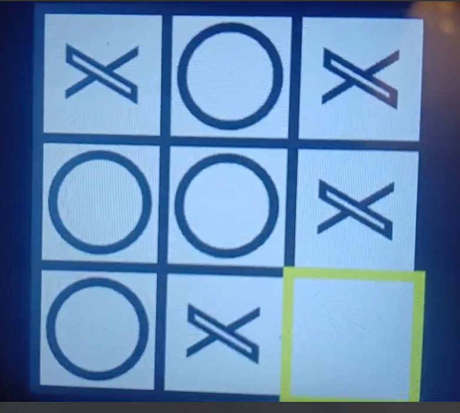

    
#  🎮 GameBoy Project 🎮  

# Games List :

- XO Game
- Maze Game
- Long Cat Game
- Alien Invaders
- Color Break

---

- Firstly, We have made a UI to make you choose your game with a yellow border cursor. Also , There is an exit button for each game that takes you to the UI Screen.

  

# Features of Each Game :

## **- Long Cat Game :**

  

**Inspired from** : https://play.google.com/store/apps/details?id=com.martinmagni.longcat&hl=ar

1. **Level Design**:
   - The game is segmented into levels, each with a unique map configuration stored in data sections (**`Level1Map`**, **`Level2Map`**, **`Level3Map`**). The maps use hexadecimal representations to define initial wall and path patterns for each level.
2. **Grid Rendering** (**`TFT_DrawMap`**):
   - The display function initializes the game board based on the snake map data. It uses **`TFT_Filldraw4INP`** to fill areas with specific colors (blue for background, white for playing area, and green for snake path cells).
3. **Player Movement** (**`Draw_Snake_Movement`**, **`Move_Snake`**):
   - Players can move the "snake" manifestation (or long cat) in cardinal directions controlled through the **`Move_Snake`** function. This function adjusts the snake's position based on user inputs (up, down, left, right) and updates the map appropriately. Players earn progression by filling grid segments.
4. **Coordinate Calculation** (**`Get_Coordinates`**):
   - Transforms cell numbers into screen positions to accurately reflect the snake's path on the display grid. This function ensures movement corresponds visually to the player's directional inputs.
5. **Visual Feedback and Snake Drawing** (**`TFT_DRAWSQUARE`**, **`Draw_Snake_Movement`**):
   - These functions handle the graphic rendering of the snake's movement across the board, using color changes and position updates to provide players with tangible interaction feedback.
6. **Win/Lose Conditions** (**`check_win`**):
   - Determines game-winning or losing conditions by evaluating the completed map paths. Win scenarios occur when all cells are filled, while lose conditions are triggered by isolating the snake's path or blocking further progress.
7. **Game Progression and Level Management**:
   - The game progresses through levels upon successful completion of the existing one. Logic within **`MainGame_LongCat`** controls progression based on the current level status. Players can navigate through various difficulty levels offered by different map configurations.
8. **Difficulty Variation**:
   - Offers different levels of challenge with distinct map layouts and increasing complexity, granting players diversified game experiences to test their logical movement planning.
9. **Restart and Exit Options** (**`MainGame_LongCat`**):
   - Provides functionality to restart levels upon losing or pathways to exit if chosen, enhancing player control over game flow.

## **- Alien Invaders :**

  

1. **Player and Enemy Bullets**
   - **Shooting Mechanism**:
     - _Code_: **`ADD_BULLET_PLAYER`** and **`ADD_BULLET_ALIEN`**
     - _Description_: The player fires bullets tracked by the **`Player_Bullets`** array, and enemies shoot using the **`Enemy_Bullets`** array.
2. **Drawing Bullets**
   - _Code_: **`DrawBullet_Player`** and **`DrawBullet_Enemy`**
   - _Description_: Bullets are visually represented in specific colors—Pink for player bullets and Orange for enemy bullets—to enhance visibility and gameplay clarity.
3. **Movement and Collision**
   - **Player Movement**:
     - _Code_: **`Move_Player`**
     - _Description_: Allows the player to navigate left or right through the grid, aiding in strategy and avoiding enemy fire.
   - **Bullet Motion**:
     - _Code_: **`MOVE_BULLET`**
     - _Description_: Manages the vertical movement of bullets, simulating realistic projectile motion.
   - **Collision Detection**:
     - _Code within_: **`MOVE_BULLET`**
     - _Description_: Detects and clears bullets upon collision, ensuring accurate gameplay.
4. **Game State Representation**
   - **Score and Hearts**:
     - _Code_: **`Score_Draw`**, **`Increment_Score_And_Draw`**, **`Heart_Draw`**, **`Decrement_Heart_And_Draw`**
     - _Description_: Score displays current performance, while hearts represent lives—the mechanics tracking and updating lives and scores.
5. **Game Over Conditions**
   - _Code_: **`check_all_bit15`**
   - _Description_: Identifies win or lose conditions by checking the depletion of enemies or remaining hearts.
6. **Random Enemy Behavior**
   - _Code_: **`ENEMY_BULLET_RATE`**
   - _Description_: Introduces unpredictability by varying enemy shooting patterns and rates using random functions.
7. **Graphics and Initialization**
   - **Grid Initialization**:
     - _Code_: **`Intialize_Grid`**
     - _Description_: Paints the game area and initializes graphical elements for starting gameplay.
   - **Visual Representation**:
     - _Code_: **`DrawWa74`**, **`DRAW3ARABYA`**
     - _Description_: Uses colors to delineate game objects and portray motion or static visuals.

## **- XO Game :**

  

1. **Grid Drawing** (**`TFT_DrawGrid`**):
   - Sets up the grid with distinct colors using **`TFT_Filldraw4INP`** to fill areas on the display. The grid lines are drawn with specific color codes to differentiate sections of the game board.
2. **Player Interaction and Input Handling**:
   - Players navigate the cursor and make selections using commands managed with **`GET_state`**. The cursor moves across the game board in response to user inputs analyzed in **`MAINLOOP`**.
3. **Move Cursor** (**`TFT_MoveCursor`**):
   - The function shifts the cursor position within the grid based on input directions (up, down, left, right). Colors are updated to reflect movement visually, switching the cursor's border color from yellow (active) to black (inactive).
4. **Draw X/O** (**`Draw_XO`**, **`Draw_X`**, **`Draw_O`**):
   - Depending on the current player's turn, X's or O's are drawn on the grid. The logic determining cell position is comprehensive, allowing players to mark positions freely across the board. **`Draw_X`** and **`Draw_O`** handle the specifics of drawing the respective player marks on the board.
5. **Win Condition Check** (**`Check_Win`**):
   - Evaluates if either player has won based on standard tic-tac-toe win conditions. Bitmask comparisons against known winning patterns offer reliable win detection. The function also checks for a draw if the board is full.
6. **Game State Management**:
   - Manages turn alternation (**`XO_Turn`**) and counts moves (**`XO_counter`**). These values track current game progress, switching players appropriately after each move.
7. **Score Representation** (**`Num_to_LCD`**):
   - Updates the score visually on the display, reflecting each player's current score after winning a round.
8. **Display Updates** (**`DrawXWINS`**, **`DrawOWINS`**, **`DrawTA3ADOL`**):
   - These functions handle scenario-specific screen updates:
     - **DrawXWINS**: Displays visuals of X's victory across the screen.
     - **DrawOWINS**: Displays visuals of O's victory across the screen.
     - **DrawTA3ADOL**: Signals a draw with a specific screen color.
9. **Game Restart and Exit** (**`Main_Game_XO`**):
   - Implements a loop to restart the game or allow exiting based on player input, clearing board data and scores for a fresh start.
10. **Interactive Visuals**:
    - Frequent updates to the display provide dynamic feedback for actions such as drawing on the board, score changes, and movement validation with **`DrawBorder`**.

## **- Maze Game :**

  

1. **Maze Layout** (**`TFT_DrawMapM`**):
   - The function draws the maze map on the screen using predefined data stored in **`ROW`** and **`ROW2`**. These data sections use hexadecimal values to represent walls and paths within the maze.
   - Walls are drawn in specific positions as black squares using **`Drawsquare`**, visually forming the maze structure.
2. **Player Interaction**:
   - The player navigates the maze using input-based movement. Directional controls allow movement up, down, left, and right. The position is adjusted and validated within the function **`Redraw_player`**.
3. **Movement and Player Display** (**`Redraw_player`**):
   - Logic for cursor movement is implemented. It updates the player's position within the maze based on received input (from **`GET_state`**). Visual feedback is given by changing the color of squares as the player moves.
4. **Win/Lose Condition Check** (**`check_win_lose`**):
   - The game checks for a victory condition by comparing the player's cell position to the defined winning cell (**`CellWin`**). If the player reaches this cell, they win the game.
   - Conversely, if the player steps onto a "lava" cell (bit is 1), they lose, causing the game to restart.
5. **Game Initialization and Looping** (**`MAIN_MAZE`**):
   - Initializes player position at the start of the maze (**`CellStart`**), displaying the initial map layout.
   - The main function loops, processing player inputs, updating positions, and checking for win/lose conditions. Restart or exit logic is handled based on game state.
6. **Game Restart and Exit Handling**:
   - Logical conditions ensure players can restart the game upon losing or choose to exit the maze entirely, enhancing player control.

# - Color Break :

  

**Inspired from** : https://play.fancade.com/5F5A4E32A2926D92

1. **Level Encoding :** Levels in the game are encoded as a series of 32-bit words (**`DCD`**). Each 4 bits represent a block type within an 8x8 grid:
   - **Example Encoding**: **`DCD 0x11144001`** suggests that each hexadecimal digit represents a block type, where '1', '4', '4', and '0' correspond to wall blocks, breakable blocks, etc.
2. **Block Functionality :** Various block types serve different functions in the game:
   - **Wall blocks (0x1)**: These blocks prevent player movement.
   - **Color change blocks (0x2, 0x3)**: Change the player's color.
   - **Breakable blocks (0x4, 0x8)**: These can be destroyed if the player matches their color with the block color.**t**
3. **Functions for Movement :**
   - **Vertical Movement Function**: Called **`UP_DOWN_MOVEMENT`**, it handles how the player character moves vertically within the game.
   - **Horizontal Movement Function**: Named **`DRAW_BALL_MOVEMENT`**, it deals with horizontal movement.
4. **Block Destruction Logic :**
   - **`Check_Block_BLUE_UP`**: This routine checks if the player's color matches the block color and decides if it can be destroyed.
   - **Logic Detail**: It loads the player's color and checks against a condition (**`TST R0,#1`**). If the condition is met, it doesn't destroy the block (**`BNE ADD17`**), otherwise, it calls **`Destroy_Block`**.
5. **Player Character Rendering:**
   - **`Draw_Filled_Circle30`**: Utilizes Bresenham's circle drawing algorithm to render the player in a circular form, ensuring efficient pixel calculations.
6. **Level Completion Logic:**
   - **`Check_Win` FUNCTION**: Scans the map for breakable blocks. If none remain, the level is considered complete.

---

## Hardware Components :

- STM32F401RCT6
- TFT ILI9486
- 6 Push Buttons
- Breadboard
- Wires
- Battery Holder
- R KIT

---

## Contributors

  
  
  
  
  
  
  
  

